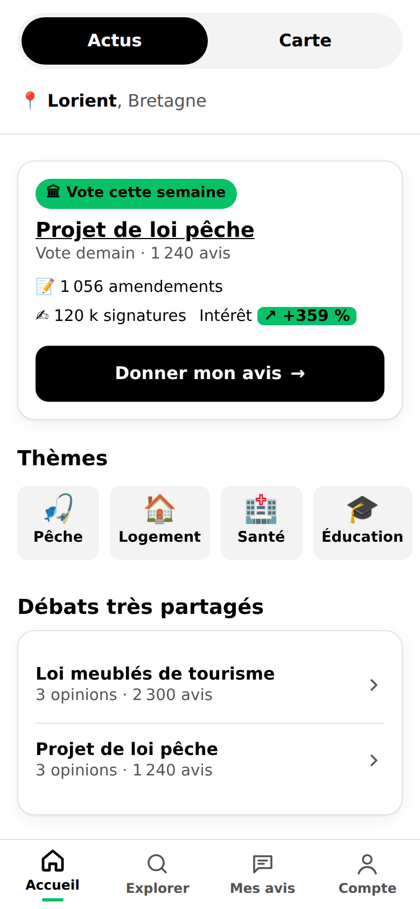
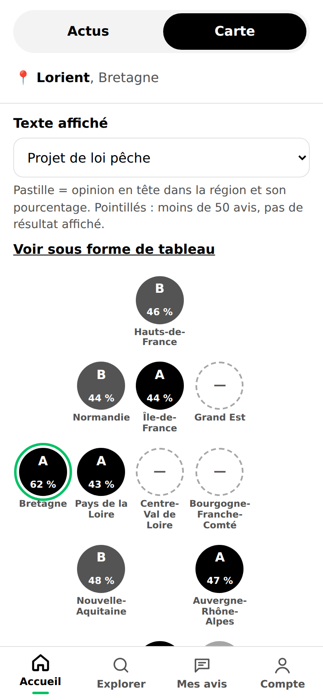
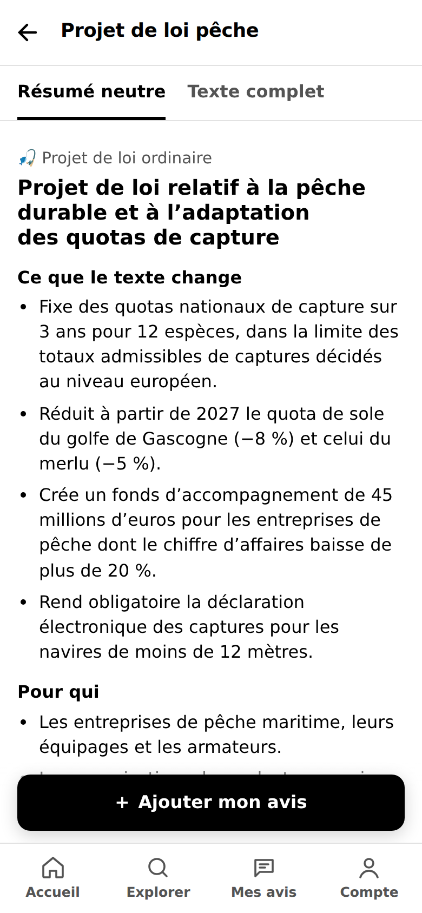
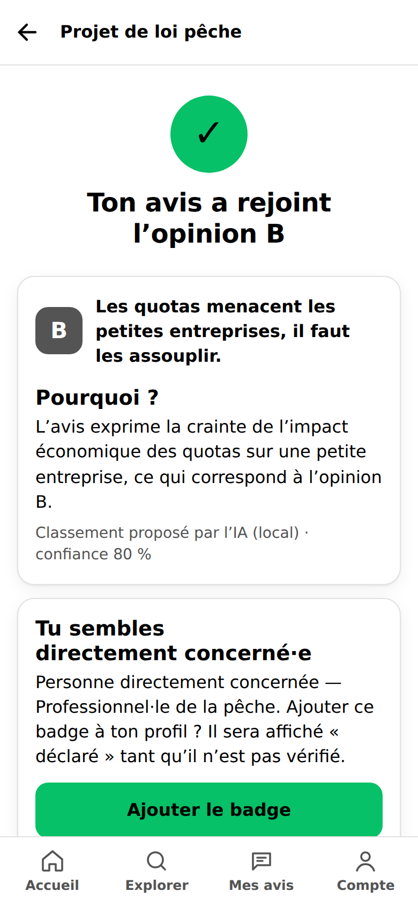

# CivicPulse (nom provisoire)

Application mobile d’intérêt public : lire le résumé neutre d’un texte de loi en discussion, donner son avis en texte libre, et voir comment les avis se regroupent en opinions (A, B, C…), par région et par profil.

**MVP** : une loi complète, le *projet de loi pêche* (données fictives réalistes), plus quatre textes légers pour faire vivre l’accueil, la carte et le score.

| Accueil | Carte | Détail | Confirmation |
|---|---|---|---|
|  |  |  |  |

## Lancer le projet

Prérequis : Node.js 20 ou plus.

```bash
npm install        # optionnel : n'installe que le SDK Anthropic
npm start          # http://localhost:3000 (ouvrir en affichage mobile)
npm test           # 39 tests unitaires et API
npm run e2e        # parcours complet dans Chromium + captures dans docs/captures/
npm run ingest     # lance les connecteurs et affiche le score de chaque texte
npm run fixtures   # régénère les fichiers fictifs des sources officielles
```

Sans clé API, les avis sont classés par un classement local de secours. Pour utiliser Claude :

```bash
ANTHROPIC_API_KEY=... npm start
```

Les données fictives sont datées autour du **30 septembre 2026** (vote au Sénat le lendemain). Pour utiliser la date du jour : `CIVICPULSE_NOW=now npm start`.

## Les livrables

| Demandé | Où |
|---|---|
| 1. Les 3 écrans, mobile-first, navigation fonctionnelle, métriques | `public/` (Accueil, Carte, Détail + saisie, confirmation, Explorer, Mes avis, Compte) |
| 2. Schéma de base de données en diagramme | [`docs/schema-base-de-donnees.md`](docs/schema-base-de-donnees.md) (Mermaid) et [`db/schema.sql`](db/schema.sql) |
| 3. Connecteurs simulés et score de pertinence | `server/connectors/` (un fichier par source), `server/scoring.js`, fichiers bruts dans `server/fixtures/` |
| 4. Prompt de classement des avis | [`docs/prompt-classement.md`](docs/prompt-classement.md), code dans `server/ai/` |
| 5. Choix techniques expliqués | [`docs/choix-techniques.md`](docs/choix-techniques.md) |

## Organisation du code

```
server/
  index.js              serveur HTTP (API JSON + fichiers statiques), tâches planifiées
  config.js             seuils (50 avis/région, score 40, 7 jours, 30 jours), régions, catégories
  store.js              données en mémoire (mêmes entités que db/schema.sql) et règles métier
  scoring.js            score de pertinence
  connectors/           assemblee.js · senat.js · petitions.js · wikimedia.js · liens.js
  fixtures/             fichiers FICTIFS au format des sources officielles
  ai/                   prompt de classement, classifieur (Claude ou local), prompt de résumé
  moderation/           pré-filtre (haine, menaces, données perso) et détection de campagnes
  data/                 contenu éditorial et participation simulée (déterministes)
public/                 front mobile (HTML, CSS, JS natif, sans framework)
tests/                  tests unitaires/API (node:test) et parcours navigateur (tests/e2e)
db/schema.sql           schéma PostgreSQL de production
docs/                   diagramme, prompt, choix techniques, captures
```

## Vérification

### Ce qui a été testé

| Point | Comment | Résultat |
|---|---|---|
| Navigation entre onglets | Playwright : clic sur les 4 onglets, sélecteur Actus/Carte, `aria-current`, titre de chaque écran | ✔ |
| Affichage mobile | Chromium 390 × 844 : aucun débordement horizontal sur chaque écran, cibles tactiles ≥ 44 px, captures relues ; aussi 1280 px et mode sombre | ✔ |
| Classement de l’exemple | « Je suis pêcheur à Saint-Jean-de-Luz… » → **opinion B**, explication exacte du cahier des charges, profil « personne directement concernée (à vérifier) » ; testé en unitaire, par l’API et dans le navigateur, puis contestation vers C | ✔ (classement local) |
| Calcul du score | Tests unitaires de chaque composante et des 5 textes : pêche 88 (« Vote dans 1 jour »), meublés 65, soins 55, voie pro 24 (Explorer seulement), eau agricole hors du fil | ✔ |
| Connecteurs | 842 amendements dont 97 adoptés, scrutin 312/180 ventilé par groupe, 214 amendements Sénat, 120 431 signatures, pic Wikipédia +359 %, flux AN incrémental, source en panne sans blocage | ✔ |
| Seuil de 50 avis | L’API ne renvoie aucun pourcentage sous le seuil ; pastilles grises sur la carte | ✔ |
| Campagne coordonnée | 42 faux avis identiques de comptes récents détectés et exclus des pourcentages ; pas de faux positif sur des avis identiques de comptes anciens | ✔ |
| Modération, RGPD, sécurité | Menace refusée, e-mail/téléphone masqués, export/suppression des données, HTML dans un avis affiché comme du texte, CSP sans erreur | ✔ |
| Schéma SQL | Exécuté dans un PostgreSQL embarqué (PGlite) : 15 tables créées sans erreur | ✔ |

### Ce qui reste simulé ou à brancher

- **Sources officielles** : les 4 connecteurs lisent des fichiers fictifs (`server/fixtures/`) au format simplifié des vraies publications. Pour chacune, remplacer `recuperer()` par le téléchargement réel (URL dans `URL_REELLE`). Le format exact des exports AN et Dosleg devra être ajusté champ par champ sur les vrais fichiers.
- **Classement par Claude** : le code d’appel est écrit et testé avec un client simulé, mais **aucun appel réel n’a été fait** (pas de clé dans cet environnement). À faire en premier : passer 100 à 200 avis annotés à la main et mesurer le taux d’accord.
- **Résumés neutres** : rédigés à la main pour la démo. Le prompt de génération existe (`server/ai/prompt-resume.js`) mais n’est pas branché.
- **Comptes** : un seul utilisateur de démonstration (Lorient, Bretagne), sans connexion.
- **Vérification des badges** : seule la clé de contrôle ORCID/SIREN est vérifiée. Il faut brancher la connexion ORCID (OAuth) et l’API Sirene de l’INSEE, et vérifier que la personne représente bien l’entreprise.
- **Base de données** : tout est en mémoire et repart à zéro au redémarrage ; `db/schema.sql` est prêt pour PostgreSQL.
- **Participation** : les 5 500 avis sont générés (phrases fictives combinées), sauf les avis « à la une », écrits à la main.
- **Légifrance (V2)** : non commencé ; l’onglet « Texte complet » renvoie vers les sites des assemblées.
- **Carte** : carte « en tuiles » (une pastille par région placée selon la géographie), pas un fond de carte exact. Plus lisible au pouce, mais à valider.

### Décisions qui vous reviennent

1. **Identité et « un compte par personne »** : FranceConnect (fiable, mais image « administration » et démarche plus lourde) ou e-mail + téléphone (plus simple, moins sûr contre les faux comptes) ?
2. **Opinions politiques et RGPD** : un avis sur une loi peut révéler une opinion politique (donnée sensible). Il faudra un consentement explicite, une analyse d’impact (AIPD) et sans doute l’avis d’un juriste ou de la CNIL avant l’ouverture.
3. **Contestation** : dans le MVP, l’auteur qui conteste reclasse son avis immédiatement (il connaît mieux que l’IA sa propre position). Préférez-vous une validation par un modérateur ?
4. **Poids du score et seuils** (40/100, 50 avis par région, 3 avis pour ouvrir une nouvelle opinion, 7 et 30 jours) : valeurs de départ à confirmer.
5. **Mise en avant des profils** : les profils vérifiés passent avant les déclarés, puis les citoyens. Faut-il aussi pondérer les pourcentages (aujourd’hui : 1 personne = 1 voix, quel que soit le badge) ? Recommandation : non, pour rester neutre.
6. **Avis en vérification** : aujourd’hui exclus des pourcentages jusqu’à relecture. Qui modère, et sous quel délai ?
7. **Ville affichée** : seulement si au moins 10 participants de la même ville sur le texte, sinon la région. Seuil à confirmer.
8. **Tutoiement** : l’interface tutoie (« Ton avis a rejoint l’opinion B », comme dans le cahier des charges). Garder ou passer au vouvoiement ?
9. **Nom définitif** et couleur d’accent (vert, choisi pour son contraste avec du texte noir).
10. **Choix du modèle IA** : `claude-opus-5-5` par défaut ; un modèle plus léger coûterait moins cher par avis. À décider après la mesure de précision.
