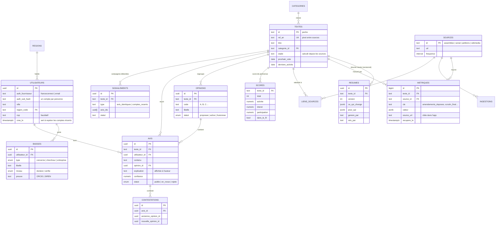

# Schéma de la base de données

Le SQL complet (PostgreSQL) est dans [`db/schema.sql`](../db/schema.sql). Le MVP tourne en mémoire (`server/store.js`) avec les mêmes entités, ce qui permet de le lancer sans base.

## Points clés

- **Un avis par personne et par texte** : contrainte `UNIQUE (texte_id, utilisateur_id)`. Un nouvel envoi remplace l’avis précédent.
- **Traçabilité des métriques** : chaque valeur garde sa source, son URL et sa date de relevé ; l’historique permet de calculer les tendances (pic Wikipédia, amendements des 30 derniers jours).
- **Opinions proposées** : une nouvelle opinion naît en statut `proposee` ; ses avis sont comptés dans « Autres » jusqu’à son activation (3 avis similaires dans le MVP, ou validation par un modérateur).
- **RGPD** : ni nom, ni e-mail en clair, ni adresse. ORCID et SIREN ne sont stockés que sous forme d’empreinte. L’effacement vide le profil et supprime les avis (`ON DELETE CASCADE`).
- **Résultats par région** : vue matérialisée `resultats_region` ; l’application n’affiche aucun pourcentage sous 50 avis.
